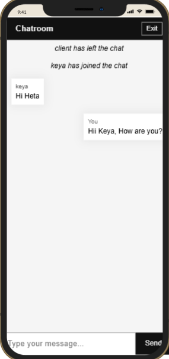

# 💬 Real-Time Chat Application

A real-time web chat application built using **Node.js**, **Socket.IO**, and **Vanilla JavaScript**. Users can join a chatroom with a username and instantly start chatting with others online.

---

## 🔗 **Live Demo**: [https://chatroom-ppdn.onrender.com/](https://chatroom-ppdn.onrender.com/)

## 📸 Screenshot




---

## 📹 Demo Video

[![Watch Demo on YouTube][https://youtu.be/3m3oJtNNKHE](https://youtu.be/Y2n9hU5xJJs)

Click the image above to watch demo.

---

## 🚀 Features

- Real-time two-way communication using WebSockets
- Join/leave notifications
- Clean and responsive UI
- Zero dependencies on frontend frameworks
- Chat scrolls automatically

---

## 🛠️ Tech Stack

- **Backend**: Node.js, Express, Socket.IO
- **Frontend**: HTML, CSS, Vanilla JS

---

## 📁 Project Structure


📦 chat-app/
├── public/
│   ├── index.html      # Frontend layout
│   ├── style.css       # Styling
│   └── code.js         # Frontend socket logic
├── server.js           # Node + Socket.IO backend
├── package.json
└── README.md

````

---

## 💻 Local Setup

### 🔧 Prerequisites

- Node.js installed on your system

### 🧪 Steps

```bash
# 1. Clone the repository
git clone https://github.com/your-username/chat-app.git
cd chat-app

# 2. Install dependencies
npm install

# 3. Run the server
node server.js
````

Visit `http://localhost:5000` in your browser to start chatting.

---

## 🌐 Deploying on Render

1. Push your code to GitHub
2. Go to [Render](https://render.com)
3. Create a new **Web Service**

   * Build Command: `npm install`
   * Start Command: `node server.js`
   * Root Directory: *(leave blank)*
4. Deploy and access your hosted app at:

```
https://your-app-name.onrender.com
```

---

## 🔁 Keep Server Awake (Optional – UptimeRobot)

To prevent Render from sleeping your app:

1. Sign up at [https://uptimerobot.com](https://uptimerobot.com)
2. Add new monitor:

   * Type: `HTTP(s)`
   * URL: `https://your-app-name.onrender.com`
   * Interval: `Every 5 minutes`
3. UptimeRobot will keep your server alive 24/7!

---

## 🙋‍♀️ Created By

**Heta Shah**
🌐 [Portfolio](https://hetashah30.github.io/MyPortfolio/)
📧 [heta312@example.com](mailto:heta312@example.com)

---

## 📜 License

This project is licensed under the MIT License.

---

## 🌟 Star this repo if you found it useful!

```
